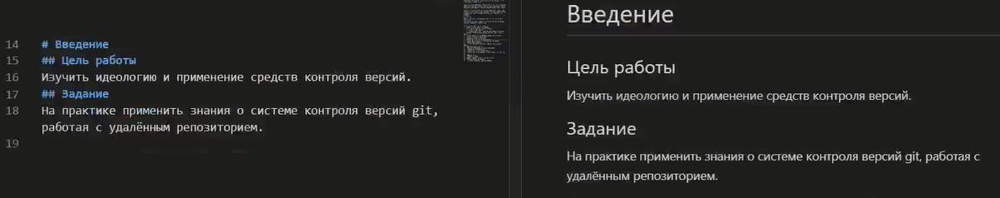
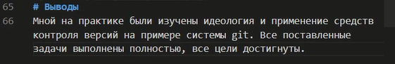
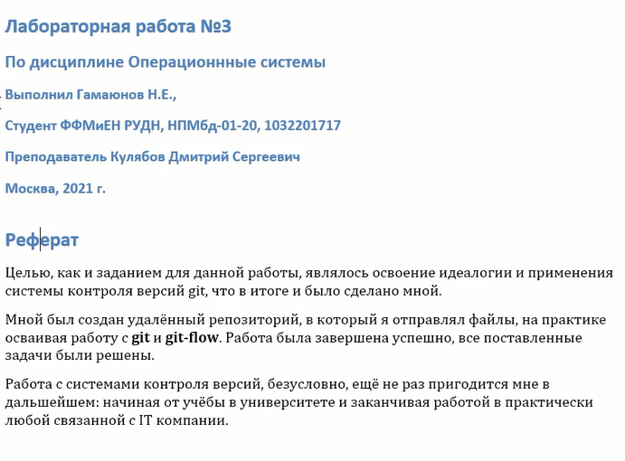

<!-- _class: titleslide -->
# Лабораторная работа №3
### Выполнил Гамаюнов Никита, 1032201719, НПМбд-01-20

---

# Прагматика выполнения работы
**Цель:** Научиться оформлять отчёты с помощью легковесного языка разметки Markdown.
**Задача:**  Оформить отчет к лабораторной работе №2 в формате Markdown.

---

# Процесс выполнения:
     Оформил титульный лист:
   

----
     Написал реферат и введение:
   
   

---

    Оформил основную часть и выводы
   
   

---
    Завершил работу, сконвертировав файл в docx и pdf:
   

---
# Результаты выполнения лабораторной работы:
Я научился оформлять отчёты с помощью легковесного языка разметки **Markdown** и получил практические навыки, оформив в markdown отчёт к лабораторной №2.