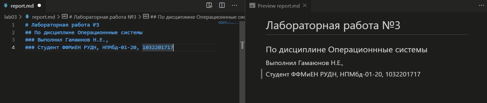
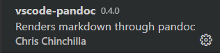
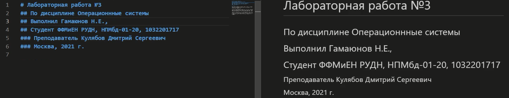
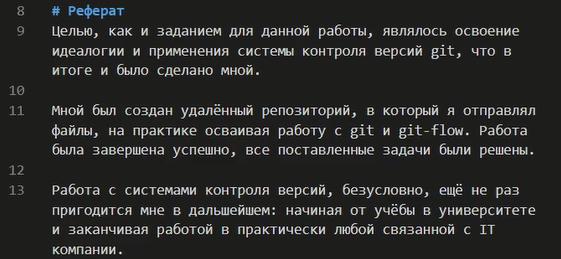
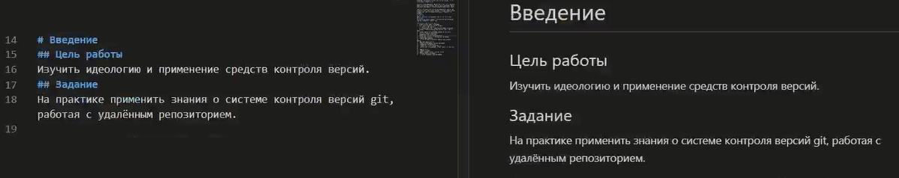
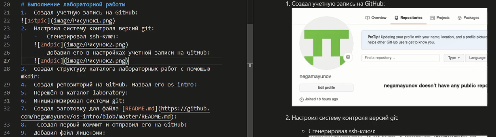
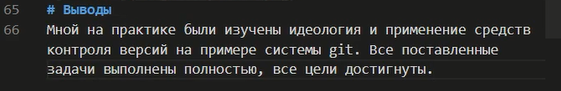
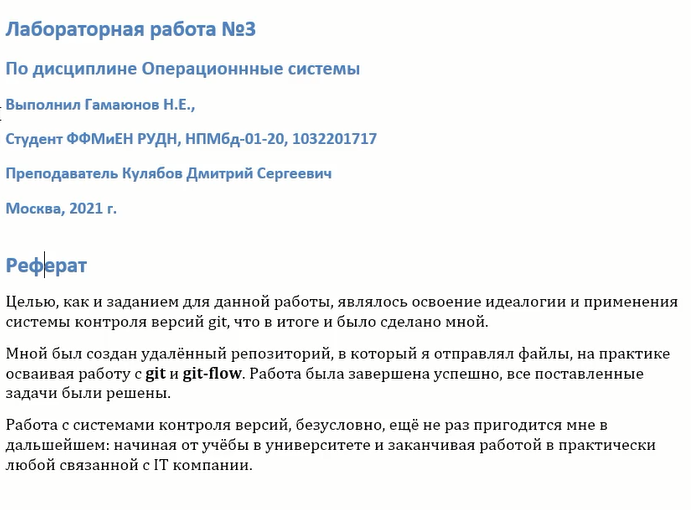
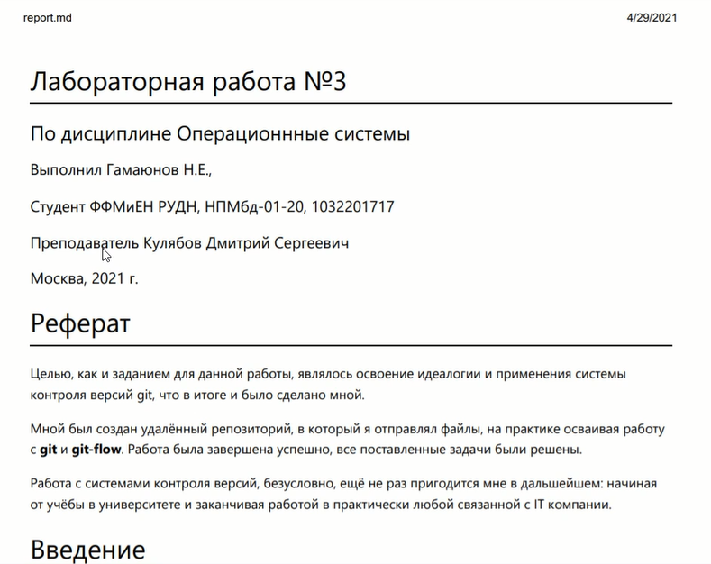

# Лабораторная работа №3
## По дисциплине Операционнные системы
### Выполнил Гамаюнов Н.Е., студент ФФМиЕН РУДН, НПМбд-01-20, 1032201717
### Преподаватель Кулябов Дмитрий Сергеевич
### Москва, 2021 г.

# Цель работы
Научиться оформлять отчёты с помощью легковесного языка разметки Markdown.
# Задание
Оформить отчет к лабораторной работе №2 в формате Markdown.

# Выполнение лабораторной работы
Я воспользовался расширением *Markdown All in One* для Visual Studio Code, - в первую очередь, из-за удобства этого расширения: можно писать код и параллельно видеть, как внесение изменений в код влияет на конечный вид файла.

Для экспорта я использовал pandoc, как и было сказано в методических материалах к лабораторной работе

1. Оформил титульный лист:
   
2. Написал реферат:
   
3. Указал свою цель и задачи во введении:
   
4. Воспользовавшись своими знаниями о прикреплении ссылок и списках в markdown, оформил основную часть:
   
5. Завершил оформление работы, сделав выводы:
   
6. Сконвертировал отчет в форматы pdf и doc:
   
   
# Выводы
Я научился оформлять отчёты с помощью легковесного языка разметки Markdown.